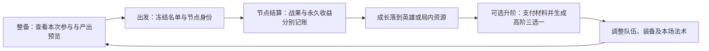

# 成长、羁绊与整局供给：设计与运行验证

2026-09-27。承接用户“规划路径→执行”。本包保留候选规则、全体系映射、成套内容与可重复的算术／供给推演，并记录随后完成的独立成长征程实现与运行证据。已确认方向不重新表决；数值参数仍作为可调起测基线。入口：[活动任务](../../../../work-items/active/growth-and-composition-design.md)、[总纲](../../content-outline.md)。

## 实施与验证交付

- 本次 goal 工程交付完成：真实 `GrowthGameRoot`、独立地区／遭遇、26单位代表包、成长生产、一次材料升阶＋固定三选一、研究法术、MX01跨战收益及隔离v8存档均已接通；Alpha入口、内容与数值不变。
- 最终构建0警告0错误；成长合同与真实工坊输入通过并查看更新截图。护阵现为15%最大生命、持续18秒；MX03换目标保层已走实际普攻验证；v7节点续行与满员时拒绝装载 `PendingDiscovery` 已修复验证。
- 最终连续路线与已知限制集中记录于 [`growth-authored-journeys.md`](runtime/growth-authored-journeys.md)、[`growth-holdout-journeys.md`](runtime/growth-holdout-journeys.md)、[`growth-elite-journeys.md`](runtime/growth-elite-journeys.md) 和 [`final-validation.md`](runtime/final-validation.md)。两条修正精英路线共赢得4场真实Elite战，但均败于第2个Boss，第三地区Elite尚未覆盖。
- 旧JSON的 `Cell={}` 限制与退出时2项资源告警保留在报告中。当前证据不代表完美平衡、完整站位回放或玩家已经接受；最终平衡与玩家体验仍待手动验收，49名全量重构不属于本 goal。

以下设计推演保留其形成时的预算、风险和供给证据；其中“候选”“未接入”等原始措辞按历史阶段理解，当前实现状态以上述记录为准。

## 本轮建议

让单位按**实际推进机会**持续产出，以**原始基础值的固定增量**安排常规培养。羁绊组织作战方式，培养改善执行能力；一次材料升阶负责机制变化和高阶新选择。三层分别记账，再一起校准，不能把三份完整强度无条件叠加。

先以每次给一个明确数值项增加基础值的 **4%** 起测，同时保留3%和6%敏感性对照。不是全属性加4%，也不是把全队战力提高4%。不设累计封顶，不以每次另交材料换取普通持续成长。攻击、毒伤、生命、护盾、技能周期并不等价，只有写清具体产物才能进入战斗校准。

## 当前基线与第一处修正

[静态基线](baseline.md)及[current-baseline.json](current-baseline.json)来自当前代码／资源：15层、三个Boss；每区两个“普通战／事件／商店”节点和两个“招募／精英／营火”节点。分支互斥。整局战斗3～15场，普通招募最多6次；开局取得2人。

因此，第15层之前按节点有14次可用成长机会，按战斗只有2～14次。**不能把15层写成15战，也不能把招募、商店、营火各出现6次当成玩家全部取得。** [模型](model-report.md)枚举全部531,441种节点选择；比例仅是组合占比，不代表玩家选择概率。当前15层是计算基线，未来修改旅程长度必须重新标定。

## 有效成长机会与归属

以下规则最初作为推演候选，后来成为独立成长征程的实现基础；具体运行口径以当前实现与活动任务为准：

1. 出发进入一个节点时冻结**已部署的持久英雄**名单。完成该节点并推进，结算一次；收益在下一层准备时可用。开局不白送一次，最终Boss后收益不计入通关战力。
2. 生产者和指定受益者都须在该次冻结名单中。新招募／升阶发现得到的英雄，从下一节点开始参加，不追溯本节点收益。后备不默认生产；明确后备内容将来单独设计。
3. 非战斗节点同样推进成长；非Boss败战后**征程全局生命仍大于零并继续推进**，也结算该次单位成长。资格读取冻结出发名单，不另要求英雄本场幸存，全队阵亡但征程继续也按该口径处理。失败仍损失全局生命及胜利物品／金币；不追加“失去全部养成”造成连续落后。Boss败战仍终局。
4. 同一节点返回整备、改站位、读档、重试结算不再发放。战内多次击中／召唤／死亡不自动增加这次运营次数。特定战内永久收益需逐条定义真实事件与预算，不能伪造额外推进。
5. 产出留在受益英雄或明确的局内资源上，生产者退场不追回已完成收益；临时羁绊、战内层数和临时盾不因此永久化。

这套资格只解决时点与归属，**不自动证明生产有足够代价**。未满10人时，生产者消耗的是一次招募选择，未必挤掉现有战斗位；玩家还可在非战斗节点部署生产者、Boss前换回战斗队。这是允许评估的经营行为，不通过临时禁换人掩盖失衡。必须将招募替代、物品损失及实际战斗表现一起比较。

## 阶段预算

下表只表示“从开局存在的一名生产者，对同一合法目标的同一基础项持续投入”。现实第2节点才取得生产者，则分别少两次。

| 检查点 | 最多有效机会 | 单源4% | 双源4% | 希望检查的阵容状态 |
|---|---:|---:|---:|---|
| 第5层Boss前 | 4 | 基础项×1.16 | ×1.32 | 基础职责可工作，至少一条有效协作；不要求深档羁绊或指定运营核心 |
| 第10层Boss前 | 9 | ×1.36 | ×1.72 | 主体系可持续运行，培养与装备已集中到能兑现的角色，补过一个关键短板 |
| 第15层Boss前 | 14 | ×1.56 | ×2.12 | 合理培养与体系配合共同兑现；允许战斗型、培养型、资源型路线不同，非满档毕业检查 |

第一轮常规观察区间：末段单核心的一个重点项累计约+35%～65%；双源集中可进入约+70%～115%。这是待检验的内容预算，**不是运行时硬上限、强制每队必须达到的值或整队倍率**。三源全程可达+168%，作为必须证明代价的集中压力样本，不能假定它自然平衡。

阶段战斗验收看相对关系，不先编造敌人统一倍率：

- 同样身份、装备与羁绊，成熟培养队应明显优于临时购入队；记录关键目标处理时间、前排存活、技能兑现次数和胜负。
- 同样取得次数与可用资源，合理接口／羁绊队应优于无协作堆面板队；不要求它抵消任意不等投入的极端数值差距。
- 抽掉关键保护／供给／控制环节应出现可解释损失，换成不同标签但能提供该接口的角色应有恢复路径。
- 无生产者的战斗路线也要能依靠装备、升阶与更强即时协作完成正常关卡；三源集中不能在所有主要威胁下都压倒其他路线。
- 成型后安排能够体现优势的战斗；普通战容错和Boss失败即终局一起评价，不以强制败战充当难度。

## 为什么先用固定增量

4%、14次、三名生产者共同培养同一项：固定加法为**2.68倍**；若同轮先合并12%再乘当前值，约**4.89倍**；若每次来源依次乘当前值，约**5.19倍**。后两者还没算羁绊、装备与技能反馈。有限旅程不能自行消除这类膨胀。

但固定加法也不等于最终收益线性：生命影响百分比护盾，攻击可能同时进入普攻和技能，施法频率会跨过多放一次技能的阈值。基础护卫400生命／8防御，现行普通伤害公式下有效生命约624；只加56%生命约973，两项都加56%约1169。因此不能把“生命、防御、攻速、控制时长都各加4%”当成一个同价成长。

具体口径：

| 产物 | 本轮可计算口径 | 必须额外记录 |
|---|---|---|
| 攻击 | 固定取得时原始攻击×成长比例之和；不读已成长攻击继续复利 | 所有受攻击驱动的普攻、技能、召唤等实际收益；不能只算普攻 |
| 最大生命 | 原始最大生命×成长比例之和 | 治疗有效量、护盾利用率、百分比生命效果、自伤阈值 |
| 毒伤／固定技能量 | 对指定原生效果的基础量设置独立倍率，不拿0法强作基数 | 毒层来源、每层伤害、有效跳数；复制／转移不得再次加培养 |
| 法力／攻速／控制周期 | 本轮不照搬4%曲线，按具体内容另列档位／触发修改 | 首次与后续施法时间、目标受控并集、实际出手与移动时间 |

现有49名MX英雄的法强都默认0，且职业内基础面板相同。直接给“基础法强+4%”不会变强；也没有证据支持T4天然追平旧核心。后续原始培养基准须随英雄实例记录，升阶／变形不重算历史收益。上述只定义预算口径，不向运行资源加字段。

## 升阶与晚来选择

用“每推进一个非终局节点1份材料、一次升阶4份”作为首轮供给标尺，最早在第4／8／12节点后形成三次机会。材料为局内共有；通用与匹配类别可混付，不同时强制两种。不是每到该节点自动升级，也不以升阶次数增加普通人口上限。

每个英雄只升一次。升阶改变原英雄机制，并给一次高阶三选一；回退／重选不能重复领取发现，奖励在生成时固定，不靠读档刷新。比较4／5／6份成本：[模型](model-report.md)分别在4/8/12、5/10、6/12产生可用机会；后两种会把首个机制转折推迟到首Boss之后。故先以4份讨论节奏，具体材料掉落分布和价格仍需内容验证。

发现候选起测为首区T3、后两区T4；阶位是供给分层，**不是升阶后英雄变成T3/T4**，也不锁定未来只有四阶。目标契约是三个不同且未拥有的合法身份，不保证全为本体系。原49池无法可靠满足三项，问题和扩展候选见下节，不能把短缺时二选一当成实现方案。升阶对象本身必须值得升级；发现的价值不能大到“随便升级谁都一样”。

新英雄用途须实测三种：保留旧核心并补功能、转投新的第二核心、为新接口调整部分阵容。第12节点后取得的新角色只剩2次成长，不能按早期培养速度假装时间充裕。若早核心单源14次为1.56，新人在第9／12节点后到场，则需约1.30／1.44的原始同项数值才能靠剩余5／2次同速成长追平。**这不是给高阶统一加30%／44%的建议**，而是说明末段新人应有即时机制价值，并把关键新方向尽量放在第8节点附近打开。

普通招募全拿时，三个检查点名册可到5／8／11；末段普通上场仍最多10，不能把11人名册当成11人同时触发羁绊。少拿两次招募则终局9人；把六次招募都换精英则终局仅5人。不能用“终局理应10人深羁绊”校准所有路径。

## 全貌、样例与供给

- [全体系映射](content-map.md)：7职业＋7体系、49个角色位置，43个保留作战身份，6个优先重构发展职责；多标签共59个格内呈现，保留空行／空列。这里的6个是首轮候选，不等于只允许6种发展单位。
- [代表内容与连续样例](samples.md)：霜羽战斗接力、构装定向培养、灰烬全局资源与法术；具体产物、升阶、替代、缺件及晚来用途。
- [数值／节点模型](model-report.md)：成长敏感性、晚来临界值、等取得次数的伤害代理、全部节点路径及资源账。
- [随机供给抽样](supply-report.md)：完整MX49测试池、七体系、两种选人策略的候选分布。与正式17人池分开；标签贪心不是理性玩家或最优构筑。

三种验证不可混称：本轮的算术能排除某些明显膨胀、供给抽样能发现不易取得的接口，**都不能给出真实胜率或认定战斗平衡通过**。既有297场没有这些跨节点成长，也不作为本轮验证结果。

## 推演之后已经回改的内容判断

原49池七体系×两种策略各5,000条，共70,000条；加四个T4供给占位后用相同规则再做70,000条，原结果保留。

| 发现 | 数字与适用范围 | 对设计的修正 |
|---|---|---|
| 原高阶池不足以兑现三选一 | 原池仅5个T4，节点12发现有15,031条路径不足三项，占原池样本21.47%；均为该处发生 | 先补高阶身份与接口覆盖。扩展9个T4后本批短缺为0，证明供给补洞方向有效，不证明新增角色已平衡 |
| 高阶标签分布影响比“每阶概率”更深 | 原池棘毒／构装无T4；补各两个后，A策略终局中档分别54.26%→88.16%、56.58%→88.58%，其他体系受候选池稀释 | 高阶供给须与全体系规划一起校准。不能把四张占位原样上线就宣布分布合理，也不能把此前差异归咎于玩家不会凑 |
| 单一培养渠道还不能作为每队必修 | 原池即使优先找第一名属性生产者，仍约两成样本最终没拿到；这还是全拿6次普通招募并给足3次发现的路线 | 不按早源14次校准所有Boss；补培养产物的兼容替代，并真测无源的装备／升阶／战斗协作路线 |
| 避战经营的金币代价很小 | 同样全招募：避开普通战88金／2次物品选择，对照94金／8次，二者均14次节点机会 | 保留节点成长建议，但必须拿两条路线真实交战，检查物品优势能否形成取舍，不靠虚构高金币代价自证平衡 |

这些比率属于候选池和固定选法，不能外推到真实玩家或正式17人池。新增GX只检验供给身份与标签；实际能力、条件性产物、站位和自然失败会改变结果。下一轮应先补单位产物与高阶供给的完整关系，再冻结可玩片段规则。

## 公共系统与界面落点

这份设计记录最初识别出单位永久贡献、单位运营结算、材料升阶及法术持有／使用的缺口；这些能力现已在独立成长征程中接通。下面保留当时形成、并用于实现审阅的流程：

| 位置 | 玩家需要看见／操作 | 所属与失败语义 |
|---|---|---|
| 整备英雄卡／详情 | 基础值、已培养增量、当前战斗加成分开；产出者显示对象／预计收益，可保持上次选择 | 数据归英雄实例；共享`.tres`不存可变成长 |
| 节点出发与结算 | 本次有哪些生产者、完成后谁获得什么；新增单位显示从下一节点参与 | 节点身份去重；回到界面不再结算。合法败战推进与终局分开 |
| 升阶入口 | 材料库存及混付、升级前后差异、随附发现；选择新人后安排上场／后备 | 扣料、一次升阶标记与奖励生成同一事务；取消未支付选择不损失材料 |
| 局内资源／法术 | 来源、存量、兑换预览、本场预设及触发条件；具体自动／手动方式由内容说明 | 不把现有战术指令直接当法术库存，不默认新增实时操作 |
| 实验室／战报 | 取得时点、累计成长、材料／法术流，逐单位战斗与运营贡献分别显示 | 同一份成长快照进入正式战斗核心；重打不修改真实存档 |

战内永久收益以拥有者实例、源效果、节点／战斗身份和增量载荷提交；正常战斗状态在战后清理。源复制、召唤单位、阵亡、撤队及结算失败都需明确归属，不能把整个战斗对象保存成永久状态。

## 已运行片段与后续验收包

先冻结本包修订后的实际内容与供给，再接入一个连续片段；不是继续堆无成长的终局快照。对照至少含：无生产源、早单源、晚单源、双源集中、三源压力、缺关键协作、晚来桥接、晚来换核、非战斗轮换生产。对每个节点保留取得／选择与放弃、成长／材料／法术账，以及进入下一战的完整快照。

每战记录每单位直接／持续／召唤伤害、有效治疗／过疗、生命承伤／盾吸收、控制时长并集、首次及后续技能次数和时间、存活／移动／有效攻击时间；运营贡献另记已生产和已兑现量。不要用最终输出低否定生产者，也不要用生产总量高证明阵容能打。

固定可复现种子的首轮证据已由最终正式路线、额外未用seed路线、holdout与修正精英路线补充，具体胜负与适用范围见上述运行报告。玩家仍需实际操作检查形成过程、阶段门槛、羁绊净收益、生产者战斗让利和整体体验；现有结果不足以宣称最终平衡或玩家体验通过。
