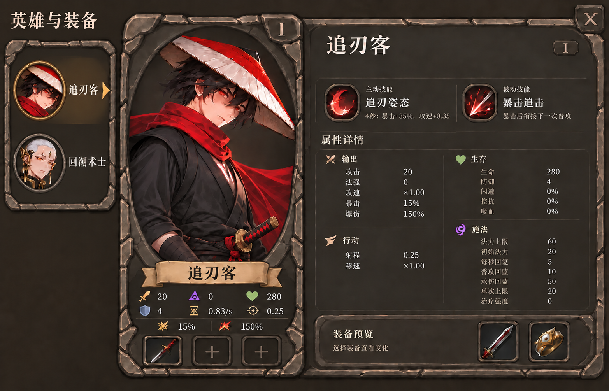

# C 英雄检视台 · 已确认并接入

用户已确认左侧紧凑头像列表及右侧一体详情，随后明确按此稿执行并删除多余稿子。

最新纠偏：用户指出此前实机右侧偏离批准稿，并重新提供 [右侧布局对照原件](user-details-layout-reference.png)。恢复其标题与阶位、技能图槽、分组图形／两栏属性与底部装备托盘；缺少具体技能图时保留空槽，不因素材不足改成纯文字布局。左侧正圆头像等后续明确修正继续保留。

正式接入保留左侧独立列表框、中间石环裁切的大立绘卡、右侧完整技能／属性／装备底板。全屏纯色底取消，透出当前游戏场景；组件底板仍保持不透明。标题位于列表外，短列表按人数收紧，长列表单独滚动。

卡面常驻攻击、法强、生命上限、防御、普攻频率、射程及暴击率／倍率，固定三槽；右侧按输出、生存、行动、施法与恢复覆盖全部 19 项属性，保留零值。详细规则在右侧阅读，大立绘不翻成文字。

原图人物、技能图形和装备仅是设计示意；运行界面绑定项目已有立绘、有效技能、实际装备和实时值。承伤回蓝显示为系数；卡面普攻频率与详情攻速倍率各自注明含义。

[实际运行截图](../runtime/README.md) · [完整编辑提示和来源记录](c-compact-roster-edit.json) · [用户当时选择的原件](c-user-selection.png)

A、B、旧 C 和错误拆框稿已按要求删除，旧方案的文字决定仍留在讨论记录；不再作为实现依据。当前实现与交互检查不等同于用户确认已达到炉石／大巴扎的整体成品品质。
