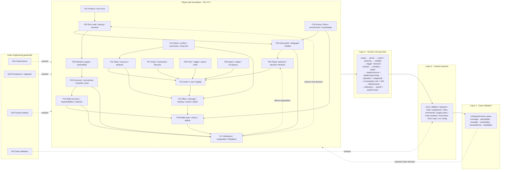

# Gameplay Model Lab

Status: Preserved Tool — Rule Snapshot Partly Stale; Not The Primary Decision Workflow

## 当前边界（2026-09-06，优先于下方历史计划）

保留关系图、交互、共享模型及用户草案。当前不继续扩建 Web 决策问卷，也不恢复独立体验切片；正式游戏工作见 `../README.md`。本文件下方的方案、域状态和冲突判断是设计时快照，不是新的玩法权威。

本轮只对齐文档，未同步 Web 目录数据或浏览器草案。使用任何旧 `Accepted` / `Open` / 本地确认记录前，必须与 `../../gameplay-design/README.md` 及对应系统契约核对；不能从界面标记推定已实现或已验收。

已知过期投影：F10/F11 的 optional mana 不再适用于持久英雄；他们已有独立法力自动施法，完整 channel/interrupt 等扩展仍未定。装备战前免费转移已确认，不再全部列为 Open。F09 的地图规格是当前基线，不能屏蔽新的地图方向。F14/术语的跨英雄供给、读取与兑现方向见正式构筑框架；未定的完整 schema 不等于这些设计方向未获确认。

## Goal

Define and review a neutral foundation-rule model for the complete game through an editable Web workbench. The model must describe invariant objects, loops, timing, space, state, resolution, composition boundaries, and feedback contracts without promoting any concrete archetype or example into the foundation.

## Confirmed Direction

- Historical 2026-09-05 follow-up moved decision work to an in-engine slice; 2026-09-06 then moved further experience work to the formal game. Preserve this graph, its model and local drafts. The slice records that transition but is no longer a new-execution entry point.

- A scenario-led decision view is the primary decision entry; the existing graph, editable foundation model, and projections remain available. First slice: one unresolved recruitment-recovery scenario with three explicit proposals, a fixed illustrative player situation, recommendation/tradeoffs, research provenance, and navigable rule links. Local tentative/confirmed/deferred decision records reference stable foundation ids in the same workspace; they do not overwrite whole-domain status or gameplay authority. Changes to linked rule semantics make an earlier decision require review. Camera-only edits do not. Further scenario population and automatic natural-language interpretation are out of scope.
- The current Shield × Ice / Shield × Earth / Shield × Marksman prototype is rejected as the primary information architecture. Those combinations were stress-test examples, not the definition of the game.
- The neutral foundation-rule directory and dependency graph are the Web workbench's authoritative baseline; hosting remains paused until user review.
- Preserve the research corpus as read-only evidence. Some later evidence framing reflects shield/element example bias; the foundation model must not treat that framing as gameplay authority.
- Separate four layers explicitly: foundation rules, generic rule grammar, content injection channels, and concrete archetype/content tests.
- The default foundation model contains no named element, shield archetype, marksman archetype, named hero, item, relic, or build.
- Existing accepted gameplay contracts remain constraints. This task organizes and exposes them; it does not silently replace accepted rules or decide deferred balance values.
- The user accepted an evidence-driven V2 structure: seventeen player-facing gameplay domains plus a separate outer engineering-guardrail layer. The existing research corpus must support and challenge the model through traceable evidence rather than being reduced to concrete build examples.
- The user clarified that confirmation authorizes rebuilding the Web workbench from V2, not stopping at a document. The local `/model-lab` route is now the active delivery surface; hosting remains deferred until the rebuilt interaction and visual direction are accepted.
- Extend the existing `web/game-mechanics-atlas` Site with a separate gameplay-model-lab route instead of creating a duplicate application.
- Treat `web/game-mechanics-atlas/research/**` and the completed deep-research corpus as read-only evidence. The new tool may refer to stable research evidence ids later, but this slice does not rewrite research assets.
- Use the confirmed layered hybrid model: stable low-level rule fields, derived system responsibilities, and human-readable build contracts.
- Preserve the confirmed generic grammar: scope, carrier, owner/authority, visibility, trigger/decision window, condition, target, state/resource, reader/read mode, operation/magnitude, consumption/limit, lifetime/reset, attribution, and payoff/payoff owner.
- Derive generator, reader, converter, payoff, and payoff owner from the low-level rule graph rather than requiring every derived label to be entered independently.
- Present the same model through complementary relationship-graph, impact-matrix, generic-grammar, and evidence-index views. Views are projections of one underlying state, not separate sources of truth.
- Concrete archetypes may later be retained only in a subordinate case-validation surface. They never define the main navigation, graph, or data model.
- Make direct manipulation the primary interaction: users can drag model domains and region frames, connect or redirect relationships, select nodes/edges for precise editing, and observe resulting causal chains and affected content channels. Buttons may support secondary actions but cannot be the main exploration mechanism.
- Use an OpenAI-site-inspired visual system: primarily black and white, large editorial typography, generous whitespace, soft gray layers, restrained rounded surfaces, minimal borders, and one quiet green status accent. Do not reuse the rejected parchment, brass, blueprint, or dense admin-dashboard treatment.
- Use The Rational Keyboard (`https://www.fritzo.org/keys/#style=piano`) as an interaction-principle reference, not a visual template: the working surface is the instrument; direct input changes system state immediately; feedback propagates through and reshapes the whole field; secondary controls retreat to the edges. In the model lab, selecting, dragging, connecting, and changing semantics must produce visible causal feedback on the graph itself rather than relying on forms or toast messages.
- Make the primary surface an editable gameplay-relationship network. Movable region frames represent design dimensions or tight mechanic clusters; node shapes represent foundation responsibilities, and directed edges represent gameplay relationships. Selecting or changing a node must distinguish direct impacts, propagated impacts, and affected content channels. Short synthesized interaction sounds may reinforce propagation and errors, but visual shape, motion, labels, and paths remain sufficient without audio.
- Keep edits device-local for this prototype. No account, backend, D1, R2, or research-file mutation is required.
- The user confirmed a full-screen instrument layout: the relationship canvas owns the viewport; top navigation and secondary actions live in an edge-reveal tray; the right inspector overlays the canvas and can be collapsed to a persistent arrow handle without forcing itself open on later node selections.
- Desktop top controls reveal on hover or keyboard focus from a thin activation edge and retreat after the pointer leaves. Touch layouts retain an explicit tap handle because hover is unavailable.
- When the inspector is manually collapsed, graph selection and propagation remain fully functional on the canvas. The collapsed rail shows the current selection and impact counts without reserving a full sidebar.

## Scope

- A concise, readable foundation-rule directory covering the complete run and battle contract.
- A dependency graph showing which foundation decisions feed which downstream systems and feedback surfaces.
- Clear labels for accepted/fixed rules, unresolved design choices, derived consequences, and content-level examples.
- A neutral interaction model for the future Web workbench: changing one foundation rule reveals direct impact, propagated impact, conflicts, and affected content channels.
- A varied future stress-test set spanning economy/recruitment, targeting/space, equipment/relics, state/resource conversion, summons, control, damage-over-time, and other orthogonal mechanisms.
- A dedicated first-viewport working surface inside the existing Site.
- A palette of carriers, states, operations, and payoff destinations.
- A spatial rule-chain canvas with visible directed relationships and selectable nodes/edges.
- A property inspector for the confirmed low-level fields.
- Synchronized graph, orthogonal-axis matrix, and entry-to-capstone build-lifecycle views.
- Immediate structural feedback for missing engine/state/payoff/survival/space, ambiguous ownership, non-consuming recursion, free conversion, and team-size quadratic-growth risk.
- A subordinate case-validation workflow that can compare deliberately varied mechanisms without making one archetype the product frame.
- Responsive desktop-first behavior with functional keyboard and touch alternatives for core manipulation.
- Local persistence plus a reliable reset to the authored seed examples.
- Existing Site navigation sufficient to reach the new workbench without turning the root into a marketing page.

## Non-Goals

- No deployment or hosting before the rebuilt local Web workbench is reviewed and accepted.
- No new concrete build, hero, item, relic, trait, element, status, enemy, or floor-rule content.
- No rewrite of the research corpus to remove its historical framing.
- No silent change to accepted gameplay or runtime architecture authority.
- No bulk ingestion of the 780 research records in this slice.
- No modification of research sources, evidence, dossiers, coverage, roster, or synthesis.
- No acceptance of Shield, Ice, Earth, Marksman, or any generated combination as final player-facing rules.
- No complete hero, equipment, relic, command, enemy, Boss, or floor-rule content plan.
- No claim to predict win rate, DPS, time-to-kill, or balance before concrete combat formulas exist.
- No Godot runtime integration, save schema, combat implementation, or gameplay-authority rewrite.
- No authentication, sharing, collaboration backend, database, or upload flow.

## Constraints

- The model must distinguish carrier, state owner, reader, converter, payoff, and payoff owner.
- Reading a state does not imply consuming it; consumption semantics remain explicit.
- Shared constraints do not imply a conversion edge.
- Every dynamic result must remain understandable in Chinese without relying on color alone.
- The first viewport exposes the work area and one useful seed state immediately.
- Existing Site package manager, hosting identity, architecture, and unrelated routes remain intact.
- Site ownership, implementation, preview, validation, and hosting follow the Sites workflow; spawned agents must not edit or deploy the Site.

## Evidence-Driven Neutral Foundation Model V2

This is a player-side rules review surface, not new gameplay authority. `Accepted` means current authority fixes the contract; `Derived` means the structure is inferred from accepted contracts and cross-game evidence and still needs approval; `Open` means the project has not chosen the rule. Evidence ids were verified read-only in `mechanic-evidence.json`. They support structural questions and failure boundaries only: no referenced mechanic, number, content identity, or historical version becomes a project rule by citation.

Corpus keyword counts used during discovery are overlapping first-pass filters. They are not prevalence, quality, frequency, market, or balance statistics; one record may match several searches, and missing wording does not prove missing design coverage.

### Four-Layer Boundary

| Layer | Owns | Must not own |
| --- | --- | --- |
| 1. Player-side foundation rules | Seventeen domains defining what the player can understand, choose, build, fight, and learn across Meta, Run, encounter, and battle. | Engine validation, save format, migration, cleanup implementation, named archetypes, or deferred balance values. |
| 2. Generic rule grammar | One reusable sentence for ownership, visibility, trigger, reading, operation, consumption, limits, lifetime, attribution, and payoff. | A catalogue of concrete abilities, items, enemies, or builds; duplicated manually entered role labels. |
| 3. Content injection channels | The legal player-facing channels through which authored content participates in the foundation. | Cross-scope mutation, concrete-id dispatch, a parallel rules engine, or hidden exceptions to foundation rules. |
| 4. Case validation | Diverse disposable stress cases proving coverage, causality, boundedness, counterplay, reachability, and explanation. | Defining the ontology or defaults through one favored example. |

Outer engineering guardrails constrain all four layers but are not additional gameplay domains.

### Layer 1 — Seventeen Player-Side Gameplay Domains

| ID / gameplay domain | Responsibility | Inputs | Outputs | Key dependencies | Affected channels | Status / unresolved edge | Evidence signals |
| --- | --- | --- | --- | --- | --- | --- | --- |
| F01 Product and out-of-run boundary | Bound the promise and entrances: single-player tower run, starting choice, unlock/difficulty wrapper, restart, resume, settings, and developer sandbox separation. | Meta state, starting selection, settings, saved Run, chosen mode. | New/resumed Run, restart/failure handoff, unlock handoff, clearly separated sandbox entry. | F02, F05, F17; G03. | Meta unlocks, starting selection, difficulty, settings, save/resume, developer Lab. | **Derived.** Product identity and save/resume exist; complete Meta progression and unlock economy are Open. | `ev-backpack-hero-031-story-quick-game-layer`, `ev-gods-vs-horrors-018-ladder-casual-failure-contract`, `ev-slot-017-run-persistence-performance`: separate onboarding/sandbox entrances, failure contracts, and resumability should be explicit boundaries, not copied modes. |
| F02 In-run route, pacing, and termination | Define how the player advances through visible tower decisions, spends a finite adaptation horizon, settles nodes, and reaches final success or committed failure. | Route state, node offer, roster/build state, battle settlement, run risk/resources. | Next decision, changed Run state, cash-out/continue consequence where authored, final success/failure. | F01, F03–F06, F15–F17; G03. | Route, combat/elite, recruitment, shop, event, rest, reward, Boss. | **Accepted** at the high-level loop. Route topology, node cadence, risk curve, and exact retry/checkpoint policy are Open. | `ev-loot-loop-002-decaying-health-time-budget`, `ev-survivor-mercs-016-extraction-economy-rework`, `ev-guildrun-018-boss-token-rewind-transactions`: run time/risk, deeper value, and retry settlement must be named decisions with transactional boundaries, not assumed universal clocks or extraction. |
| F03 Battle loop and victory/defeat | Preview and deploy, resolve automatic real-time combat with bounded intervention, stop on one terminal truth, preserve the final field, report, then settle once. | Formation, enemy/environment package, loadouts, seed, tactical loadout, battle rules. | Immutable outcome and contribution facts; victory/defeat/timeout settlement input. | F04–F13, F16, F17; G01, G04. | Units, abilities, equipment, relics, commands, encounters, floor rules, report. | **Accepted.** Persistent player survival governs continuation and reports are mandatory; timeout threshold and simultaneous terminal/tie precedence are Open. | `ev-skull-horde-004-death-respawn-life`, `ev-loot-loop-014-death-win-settlement-rework`, `ev-dungeon-tactics-idle-006-stalemate-speed-guard`: unit defeat, battle terminal priority, and anti-stalemate policy must remain separate explicit rules. |
| F04 Player authority and decision windows | State what the player controls directly, when input is legal, what remains autonomous, and which observation controls never alter simulation truth or consume combat resources. | Current phase, pause/speed state, deployment state, equipped commands, costs/limits, available decision surface. | Legal decision window, submitted intent, or localized rejection; unchanged autonomous ownership. | F02, F03, F05, F10, F17. | Route choices, formation, inspection, pause/speed, tactical commands, report continuation. | **Accepted.** Preparation plus two independent commands/three Battle-local points are fixed; any future mid-combat authority outside this boundary is Open. | `ev-survivor-mercs-003-commander-merc-control-boundary`, `ev-girls-of-the-tower-004-active-card-ownership`, `ev-loot-loop-010-automation-manual-rerun-boundary`: autonomous units, player-owned commands, and phase-specific attention gates require explicit authority rather than blurred micro-control. |
| F05 Information, telegraphing, and hidden state | Define what the player knows before commitment, during resolution, and on demand; distinguish visible uncertainty from concealed rules. | Enemy/floor package, offer legality, target/action state, probabilities or eligibility where exposed, inspection request. | Preview, intent, comparison, tooltip/detail, uncertainty/hidden marker, actionable failure chain. | F02–F04, F06, F09, F16, F17. | Route, recruitment/shop/rewards, deployment, enemy preview, inspection, HUD, report. | **Derived.** Enemy composition/floor rules and core unit facts are visible; probability disclosure, pool visibility, intent horizon, and legitimate hidden information are Open. | `ev-tft-004-scouting-positioning`, `ev-backpack-hero-023-readable-enemy-counter-packages`, `ev-auto-chess-023-pool-blocking-and-legendary-discovery`: information must create an actionable response window while eligibility and hidden discovery remain distinguished. |
| F06 Random generation, supply pools, and reachability | Govern how legal offers are generated, when an option is impossible versus merely unlikely, and whether a pivot or required answer can be reached inside the remaining Run horizon. | Authored pools, unlock/eligibility state, weights, seed, current build, route horizon, correction actions. | Offer set with provenance, reachability/feasibility signal, corrected pool state, or explicit unavailability. | F02, F05, F14–F16; G01, G02. | Recruitment, equipment/relic rewards, commands, shops, events, encounters, Meta unlocks. | **Open.** Seed ownership exists, but pool composition, weights, pity/correction, duplicate rules, and feasibility guarantees are not fixed. | `ev-gods-vs-horrors-017-pool-pivot-reachability`, `ev-mpig-007-chest-weight-grade-wall`, `ev-shf-019-unproducible-reward-rng-negative`: catalogue breadth is insufficient; zero eligibility, dead offers, correction paths, and remaining adaptation time must be modeled. |
| F07 Entity, ownership, and lifecycle | Distinguish persistent roster heroes, optional temporary units, teams, source instances, carriers, owners, spawned children, join/defeat, transfer, and cleanup. | Authored identity, runtime instance id, team, source, owner, spawn/join/defeat facts. | Legal entity, ownership/source chain, active lifetime, removal/transfer consequence, report identity. | F03, F08–F13, F17; G04. | Heroes, enemies, temporary units, equipment owners, relic team, commands, saves/reports. | **Accepted.** Persistent heroes share one contract; temporary units are Battle-only, occupy cells, retain source attribution, and cannot keep battle alive. Resurrection remains opt-in content with an Open general contract. | `ev-storybook-brawl-012-summon-occupancy-ownership`, `ev-astro-017-summon-source-death-cleanup`, `ev-tft-002-item-holder`: spawn intent, occupancy, persistent ownership, source death, and bridge/transfer ownership are separate lifecycle questions. |
| F08 Time, triggers, and action order | Define simulation time, cooldown/duration clocks, snapshots, simultaneous intents, trigger ancestry, stable precedence, delayed work, and when a chain terminates. | Tick/time, queued intents, immutable event, trigger, priority, limit, pause/speed observation state. | Ordered actions/events, next legal reaction wave, bounded terminal chain, player-readable order. | F03, F07, F10–F13, F17; G01. | Attacks, abilities, statuses, traits, equipment, relics, commands, summons, floor rules. | **Accepted** at deterministic/non-reentrant architecture level. A complete player-facing same-tick precedence table is Open. | `ev-storybook-brawl-018-trigger-readability-recursion`, `ev-monster-train-025-spawn-order-rollback`, `ev-neon-auto-party-020-effect-resolution-liveness-fixes`: nested triggers, simultaneous deaths/spawns, and liveness failures justify explicit order, ancestry, and bounds without inferring hidden implementations. |
| F09 Space, targeting, and occupancy | Own board topology, deployment legality, one-cell occupancy, range/line access, target identity, engagement goals, pathing, body blocking, arbitration, displacement, and spatial previews. | Logical grid, terrain/floor legality, occupancy snapshot, teams, reach, target query, move intents. | Legal cells/targets/goals/moves, rejected alternatives, movement/displacement facts, changed access. | F03–F05, F07, F08, F10, F16, F17. | Deployment, unit AI, attacks/heals, abilities, temporary units, commands, floor/environment. | **Accepted.** `10×6`, player columns `0..2`, 18 candidate cells, unique occupancy, and deterministic arbitration are fixed. Exact role weights, leases, and displacement policy are Open. | `ev-guildrun-005-targeting-reposition-counterpack`, `ev-tak-017-row-column-localization-failure`, `ev-monster-train-021-last-divinity-three-floor-exam`: selection, reachability, selector shape, and multi-zone pressure need separate inspectable spatial rules. |
| F10 Actions, costs, and legality | Define every automatic or player-initiated attempt through authority, target, condition, cost, cooldown, use/capacity limit, complete preflight, commit, and no-cost failure. | Entity/action state, decision window, target/space result, resources, cooldown/use limit, effect plan. | Accepted intent and atomic cost/effect, or typed rejection with no partial mutation. | F04, F07–F09, F11–F13, F17; G03. | Unit behavior, abilities, tactical commands, equipment/status granted actions, build transactions. | **Derived.** Immediate automatic actions and tactical-command atomicity are fixed. A universal mana/cast/channel/interrupt grammar is Open and remains optional. | `ev-monster-train-024-transaction-feedback-rework`, `ev-loot-loop-004-power-active-resource`, `ev-backpack-hero-013-cr8-execution-graph`: target, cost, capacity, provenance, execution path, and manual resource ownership must be preflighted and inspectable. |
| F11 States, resources, and attributes | Define named mutable facts, their scope owner and lifetime, read mode, reset/cap, and how base/additive/multiplicative/override projections become current combat values. | Base definitions, sourced contributions, Run choices, runtime events/results, snapshot/live read request. | Current/clamped value, resource delta, state/tag fact, reversible sourced projection. | F07, F08, F10, F12, F13, F17; G04. | Health, protection, optional mana, tactical points, currency, population, statuses, counters, charges, traits. | **Derived.** Sourced attributes, population landmarks, and tactical points are fixed. Canonical resource taxonomy and generic-versus-system-specific meters are Open. | `ev-gods-vs-horrors-011-japanese-sp-lifecycle`, `ev-dungeon-tactics-idle-002-base-stat-layering`, `ev-slay-the-spire-014-stance-resource-rules`: shared resource readers, base/final capture, and state-linked risk/exit rules must be explicit rather than flattened into one meter. |
| F12 Effects, damage, healing, control, and death | Resolve one legal request into attempted and effective value, mitigation/protection, health change, healing, control, lethal transition, kill ownership, cleanup, and later reactions. | Source/owner, target, effect kind, magnitude, current state, resistance/modifiers, order. | Effective result/event, state delta, control lifecycle, defeat/kill, queued reaction, report contribution. | F03, F07–F13, F16, F17; G01, G04. | Attacks, abilities, statuses, equipment, relics, commands, floor/environment. | **Accepted** at the authoritative transaction/event boundary. Full player-facing formula order, protection overflow, conversion order, and simultaneous lethal resolution are Open. | `ev-shf-012-knockback-progressive-resistance`, `ev-siralim-ultimate-019-historical-cleric-cap-counter`, `ev-survivor-mercs-018-merc-resolution-attribution-lifecycle`: control needs bounds, sustain loops need caps/counters, and effective resolution must agree with visible/report facts. |
| F13 Stacking, conflicts, conversions, and loop limits | Resolve competing contributions and transformations through aggregation identity, source isolation, additive/multiplicative/override order, refresh/replacement/overflow, dispel, consumption, recursion, caps, and anti-stalemate limits. | Multiple bindings/contributions, source identity, priority, aggregation/read/consume policy, chain ancestry. | One deterministic projection or typed incompatibility; bounded follow-up work; reversible handles and visible cap. | F08, F10–F12, F17; G01, G02, G04. | Attributes, statuses, traits, equipment, relics, counters, conversions, population scaling. | **Derived.** Several subsystem policies are fixed; one cross-system player-facing conflict/recursion policy is Open. | `ev-storybook-brawl-018-trigger-readability-recursion`, `ev-gods-vs-horrors-019-infinity-recursion-guards`, `ev-slay-the-spire-011-poison-catalyst-build`, `ev-backpack-hero-016-overheat-lifecycle`: ancestry, numeric/loop budgets, finite readers, and visible caps preserve loop fantasy without unbounded resolution. |
| F14 Build structure, responsibilities, and content injection | Define how carriers combine into a legible build: supplier/generator, state/resource, reader, converter, payoff and payoff owner, survival, space, bridge/functional role, and opportunity cost. | Available content channels, ownership graph, states/resources, spatial requirements, current roster/build. | Readable build chain, role/responsibility projection, missing-link/conflict diagnosis, content hooks. | F05–F13, F15–F17; G02. | Heroes, abilities, statuses, traits, equipment, relics, commands, temporary units, floor/reward modifiers. | **Derived.** Five-part build sentence and role hierarchy are Accepted; cross-channel grammar and derived labels await user approval as long-term authority. | `ev-survivor-mercs-004-trait-weapon-gear-owner-split`, `ev-gods-vs-horrors-004-mythology-trait-architecture`, `ev-slot-005-promotion-rarity-role`, `ev-loot-loop-003-fixed-four-role-ownership`: supplier/reader/payoff ownership, bridges, rarity, roster, and investment are independent axes of composition. |
| F15 Economy, recruitment, rewards, and pivoting | Price vertical growth, horizontal breadth, replacement, population, equipment, and future opportunity across a finite Run while keeping dead offers and recovery paths legible. | Currency/ledgers, offer pool, roster/reserve/capacity, current build, route horizon, risk pressure. | Legal acquisition/replacement transaction, changed build/resources, pivot window, opportunity-cost explanation. | F02, F05, F06, F14, F16, F17; G03. | Recruitment, shops, rewards, events/rest, population, equipment/relics, command replacement. | **Open.** Opportunity cost and ordinary growth toward population `10` are fixed; prices, currencies, growth cadence, tiers/odds, reserve capacity, replacement value, and pivot correction are deferred. | `ev-tft-001-economy-tempo`, `ev-skull-horde-002-standard-roster-economy`, `ev-dwarves-glory-death-loot-016-forge-recruit-growth-economy`: saving/spending, vertical/horizontal investment, replacement, and separate ledgers need explicit trade-offs without copying interest or merge systems. |
| F16 Enemy, Boss, environment, and counterplay contract | Turn opposition into readable exams of build links with preview, answer breadth, adaptation window, target/space implications, environment ownership, and bounded failure pressure. | Run stage, encounter package, floor/environment rule, player build, reachable answers, preview policy. | Previewable threat/counter contract, encounter setup, adaptation demand, environment facts, fair failure explanation. | F02, F03, F05, F06, F09, F12, F14, F15, F17. | Enemies, elites, Boss phases, hazards, objectives/devices, route preview, reward supply. | **Derived.** Three regions and required floor/Boss rule categories are fixed; threat taxonomy, counter breadth, escalation curve, and answer-access guarantees are Open. | `ev-dwarves-glory-death-loot-014-boss-counter-packages`, `ev-shf-015-naga-specific-answer-nerf`, `ev-backpack-hero-023-readable-enemy-counter-packages`, `ev-monster-train-021-last-divinity-three-floor-exam`: opposition should test distinct links, expose actionable intent, and avoid answer lockouts without becoming universal keyword checks. |
| F17 Attribution, explanation, and feedback | Explain every choice and result from source through owner, target, effective change, propagation, payoff owner, counter/failure link, and terminal settlement using space/shape/motion before concise text/detail. | Evaluations, immutable events/results, causal trace, offer/preview facts, selected entity/rule, presentation state. | Direct/indirect impact, Chinese reason, contribution/report facts, uncertainty marker, success/failure feedback, next actionable question. | F01–F16; G01–G04. | Every player-facing screen, battle presentation/audio, reports, and future Model Lab. | **Accepted** for source attribution, effective-value reporting, inspection, and non-color redundancy; design-time causal vocabulary/granularity are **Derived**. | `ev-pmm-001-observe-refine-repeat-loop`, `ev-survivor-mercs-018-merc-resolution-attribution-lifecycle`, `ev-storybook-brawl-018-trigger-readability-recursion`: autonomous outcomes become actionable only when preparation, targeting, cadence, ancestry, VFX, and reports tell the same causal story. |

### Outer Engineering Guardrails — Not Gameplay Domains

| Guardrail | Protects | Contract | Why it stays outside F01–F17 |
| --- | --- | --- | --- |
| G01 Deterministic execution and replay | F03, F06, F08, F09, F12, F13, F17 | Seeded fixed-step truth, stable ordering, immutable results, reproducible digest. | It makes chosen gameplay rules trustworthy; it is not itself a player build or decision domain. |
| G02 Authored-data validation and transactional publication | F06, F07, F10–F16 | Reject missing references, incompatible graphs, cycles, invalid scenes, and incomplete catalogs before play. | It guards content integrity rather than defining player-facing rules. |
| G03 Persistence, migration, and transaction integrity | F01, F02, F04, F10, F15 | Versioned stable-id DTOs, exact-once settlement, rollback on failed save, lossless or explicit-reject migration. | Save representation and migration are engineering contracts around the Run experience. |
| G04 Scope isolation, cleanup, and rollback | F03, F07, F08, F11–F13, F17 | No shared mutable definitions or cross-scope writes; success/failure/abort/disposal remove owned state idempotently. | It prevents leaks and corrupted outcomes without adding a player-visible mechanic. |

### Neutral Dependency Graph

In the future workbench, changing one node first highlights direct dependents, then propagated domains, affected content channels, validation cases, and explanation surfaces. Guardrails appear as an outer ring: they may invalidate a configuration, but they do not masquerade as gameplay content.

### Layer 2 — Generic Rule Grammar

The preserved keywords belong here, not to any concrete system. The neutral rule sentence is:

> scope → carrier → owner/authority → visibility → trigger/decision window → condition → target → state/resource + reader/read mode → operation + magnitude → consumption rule + limit → lifetime/reset → attribution → payoff + payoff owner

| Grammar term | Neutral meaning | Boundary |
| --- | --- | --- |
| Scope（作用域） | Meta, Run, Battle, team, entity, cell, or transaction lifetime in which the rule is valid. | A rule cannot write across scope without an explicit transition. |
| Carrier（载体） | The authored channel through which the rule enters play. | Carrier, runtime owner, source, and payoff owner may differ. |
| Owner / authority（归属者 / 权限） | The instance or subsystem that owns mutable state and the actor allowed to choose or commit. | Player authority and autonomous authority stay separate. |
| Visibility（可见性） | What is previewed, inspectable, uncertain, or legitimately hidden before commitment. | Hidden probability, impossible eligibility, and unknown outcome are different facts. |
| Trigger / decision window（触发 / 决策窗口） | The immutable fact or phase that opens evaluation or legal input. | Event publication cannot synchronously re-enter the mutation in progress. |
| Condition（条件） | Typed predicates for legality, eligibility, timing, space, and state. | Failure has a reason and no partial commit. |
| Target（目标） | Entity, team, cell, state, offer, or scoped collection selected by a legal query. | Strategic target, engagement goal, effect recipient, and payoff owner are distinct. |
| State / resource（状态 / 资源） | The named fact accumulated, maintained, queried, or changed. | Owner, cap, reset, capture time, and lifetime stay explicit. |
| Reader / read mode（读取者 / 读取模式） | A **读取者** is derived when a rule queries a state/resource; read mode says which source/target, snapshot/live, base/bonus/final fact is read. | Reading never implies consuming. |
| Operation（操作） | The typed evaluation or change performed after legality succeeds. | A shared condition does not imply conversion. |
| Magnitude（量值） | The typed quantity, count basis, or projection used by the operation. | Attempted and effective values remain distinct. |
| Consumption rule（消耗规则） | Whether, when, and how much of the read state/resource changes after success. | Omission cannot be interpreted as consumption. |
| Limit（限制） | Cost, cooldown, use count, threshold, cap, pool eligibility, causal depth, or other bound. | Repeatable chains and supply processes need visible stopping/correction rules. |
| Lifetime / reset（生命周期 / 重置） | Activation, duration, refresh, removal, defeat, settlement, reset, and cleanup points. | Transfer and cleanup semantics cannot be inferred from the carrier. |
| Attribution（归因） | The source/owner/target lineage credited for a decision or effective result. | Environment and unowned facts cannot be falsely assigned to a unit. |
| Payoff / payoff owner（兑现 / 兑现者） | Payoff is the victory-relevant terminal result; **兑现者** is the concrete recipient that owns it. | The payoff owner is derived from the graph, not manually duplicated truth. |

Derived responsibilities remain projections: generator creates or sustains; reader queries; converter maps an explicitly named input into a different output under an explicit consumption rule; payoff is the terminal victory-relevant result; payoff owner/兑现者 owns that result. The accepted `driver/engine + state/resource + payoff + survival + spatial condition` sentence remains a higher-level completeness lens rather than a substitute for this grammar.

### Layer 3 — Content Injection Channels

| Channel | Legal player-side influence | Required gameplay checks |
| --- | --- | --- |
| Campaign, Meta, and Run configuration | Entrances, unlock/difficulty wrapper, starting rules, route structure, pools, and Run-wide limits. | F01, F02, F05, F06, F15; never hide a rule change inside migration or implementation. |
| Route, recruitment, shop, reward, event, and rest | Present and settle finite-horizon build decisions. | F02, F05, F06, F14, F15, F17; expose legality, opportunity cost, and recovery. |
| Roster unit and unit rule | Persistent identity projected into a Battle entity with attributes, behavior, abilities, and trait contribution. | F07–F12, F14, F17; one readable responsibility and explicit source/owner. |
| Ability and automatic action | Typed action with trigger/window, condition, target, cost/limit, effect, and attribution. | F04, F08–F13, F17; atomic legality and bounded resolution. |
| Status, modifier, and trait | Sourced state, projection, tag, aggregation, lifecycle, or team threshold. | F07, F08, F11–F13, F17; stacking, reset, death, dispel, attribution. |
| Equipment | Run-owned instance attached to one persistent hero and projected through that owner. | F07, F10–F15, F17; slot, transfer/replacement, source, and payoff ownership. |
| Relic | Run-level instance projected to team/Battle or subscribed to required facts. | F07, F08, F11–F15, F17; stack/repeat, counter scope, reset, attribution. |
| Tactical command | Player-owned Run loadout projected into Battle-local points and transactional uses. | F04, F05, F08–F13, F17; window, target, cost, failure, and ownership. |
| Enemy, elite, Boss, encounter, and floor rule | Previewable opposition, environment, objective, phase, or counter package. | F03, F05, F06, F09, F12, F16, F17; answer breadth and adaptation horizon. |
| Temporary-unit source | Optional Battle entity creation from an explicit carrier. | F03, F07–F13, F17; occupancy, source death, join time, cleanup, defeat ownership. |

### Layer 4 — Diverse Pressure-Test Matrix

These are coverage tests, not content proposals.

| Stress dimension | Domains exercised | Variation to compare | Pass condition |
| --- | --- | --- | --- |
| Guided entry versus direct sandbox | F01, F05, F17 | Unlock wrapper, direct Run entry, developer Lab separation. | Each entrance states its authority, persistence, and failure contract without changing the core Run invisibly. |
| Route risk and finite adaptation horizon | F02, F05, F06, F15, F16 | Spend/continue, known threat, reachable answer, remaining nodes. | Risk, exclusive value, pivot time, and terminal consequence are all visible. |
| Terminal battle and anti-stalemate | F03, F08, F12, F13, F17 | Defeat, delayed lethal work, timeout, simultaneous candidates. | One explainable terminal result wins; unresolved precedence is flagged Open. |
| Automation versus tactical authority | F03, F04, F10, F17 | Autonomous action, pause/speed, valid/invalid command window. | Every input has one owner and failed intervention consumes nothing. |
| Visible threat versus legitimate uncertainty | F05, F06, F16, F17 | Previewed intent, hidden pool fact, low probability, impossible eligibility. | The UI distinguishes unknown, unlikely, illegal, and impossible. |
| Supply reachability and pivot recovery | F02, F06, F14, F15, F16 | Broad catalogue, constrained pool, dead offer, correction path. | Practical reachability is measurable inside the remaining horizon. |
| Temporary entity lifecycle | F03, F07–F09, F12, F17 | Spawn, full occupancy, source defeat, cleanup, report lifetime. | No persistent leak or battle-liveness error; ownership remains traceable. |
| Nested and simultaneous triggers | F07, F08, F12, F13, F17 | Attack/death/spawn chain, same-tick vacancies, delayed reaction. | Order, ancestry, cap, and terminal consequence remain readable. |
| Target access and spatial counterplay | F05, F09, F10, F16, F17 | Range/line access, body blocking, selector shape, displacement, multi-zone pressure. | Target selection and every changed access edge can be explained. |
| Costed action transaction | F04, F08–F11, F17 | Invalid target, insufficient resource, cooldown/use/capacity failure. | Preflight is complete; failure has no spend or partial effect. |
| Shared resource with several readers | F10–F14, F17 | Snapshot/live, base/final, non-consuming and consuming readers. | Supply/read ratio, consumption, attribution, cap, and payoff owner are explicit. |
| Effective resolution and control bound | F08, F11–F13, F17 | Attempted/effective value, resistance, repeated control, lethal cleanup. | VFX, runtime state, attribution, and report reconcile. |
| Conversion and recursion | F08, F11–F14, F17 | Finite multiplier, cycle, overflow, numeric saturation, non-consuming repeat. | The intended loop remains expressible while unbounded work is rejected. |
| Cross-channel build composition | F06, F07, F11, F14, F15 | Supplier, reader, bridge, survival, space, payoff ownership across carriers. | Missing links and ambiguous ownership are diagnosed without declaring every unit a core. |
| Economy and roster transition | F02, F06, F14, F15, F17 | Saving/spending, vertical/horizontal growth, holder/transfer, replacement. | Opportunity cost and rollback-safe ownership change remain legible. |
| Counter-package fairness | F02, F05, F06, F09, F14–F17 | Broad versus narrow answers, ordinary versus final exam, environment ownership. | Threat is previewable and at least one reachable response window exists under the chosen contract. |
| Causal explanation reconciliation | F03–F17 | Inspector, live feedback, report, failure chain, next decision. | The same source→owner→target→effective result→payoff lineage appears across surfaces. |

### Authority Conflicts and Open Decisions

Historical V2 audit snapshot, not a current conflict-free certification. The list below must be read with the 2026-09-06 corrections at the top and current gameplay/system authority; it cannot reopen an already settled rule:

1. Complete Meta progression, unlock economy, difficulty structure, and relationship between guided entry, direct Run entry, and developer Lab.
2. Route topology, node cadence, risk escalation, checkpoint/retry policy, exact timeout, and simultaneous victory/defeat/tie precedence.
3. Exact player authority by phase if future commands, preparation actions, or inspection controls expand; pause/speed remain observation-only under current authority.
4. Information policy: enemy intent horizon, numerical transparency, supply-pool visibility, probability disclosure, and which facts may be legitimately hidden.
5. Supply model: pool composition, weights, duplicate rules, correction/pity, dead-offer tolerance, feasibility guarantees, and practical reachability targets.
6. Initial population remains compatibility value `7` with four initial roster heroes; growth cadence, future retuning, reserve capacity/exchange, and above-`10` supply remain open.
7. Universal action grammar beyond current automatic behavior and tactical commands: mana, casting, channels, interrupts, refunds, and failure semantics for future carriers.
8. Canonical resource taxonomy and whether health, protection, optional mana, tactical points, currency, population, counters, charges, and status stacks share any universal interface.
9. Full player-facing resolution pipeline: damage/defense layers, protection overflow, healing/conversion order, control interaction, same-tick lethal effects, and environmental ownership.
10. Cross-system stacking, priority, conversion, recursion, numeric overflow, and anti-stalemate policy beyond already accepted subsystem contracts.
11. Economy details: currencies/ledgers, recruitment prices, tiers/odds, replacement value, equipment transfer, reward tables, and pivot recovery budget.
12. Opposition contract: threat taxonomy, counter breadth, answer-access guarantee, environment/objective ownership, Boss escalation, and how hard counters may be.
13. `读取者`, `兑现者`, `消耗规则`, visibility, and decision-window vocabulary are confirmed for V2 but are not yet accepted as a persistent cross-content schema in gameplay authority.
14. Evidence ids establish traceability, not design votes. Version-limited or historically corrected records must retain their limitations; corpus search counts remain overlapping keyword discovery rather than formal statistics.

## Acceptance Criteria

- The directory contains exactly seventeen player-side gameplay domains covering product/run/battle loops, authority, information, supply, entities, time, space, actions, state, resolution, conflicts, builds, economy, opposition, and feedback.
- Determinism, authored-data validation, persistence/migration, and scope isolation are represented as separate outer engineering guardrails rather than gameplay domains.
- Every gameplay domain states responsibility, inputs, outputs, dependencies, affected channels, status/unresolved edge, and two to four verified evidence ids.
- Evidence signals are cross-game where practical, retain source limits, avoid one-archetype bias, and support structural design rather than copying mechanics or treating citations as votes.
- Corpus keyword counts are labelled overlapping discovery filters rather than formal statistics.
- The dependency graph makes direct, propagated, content-channel, validation, and guardrail effects understandable without using a concrete build as the foundation.
- Accepted rules, Derived structure, Open choices, and engineering guardrails are visually and semantically distinguishable.
- Concrete archetypes appear only as later validation cases, with a deliberately diverse test set preventing single-example bias.
- The confirmed foundation model is implemented in the local Web workbench before hosting.
- Dragging or otherwise directly manipulating a model ingredient changes the graph and synchronized projections without a page reload.
- Selecting a node or edge exposes the relevant rule fields and edits update all views consistently.
- The relationship graph, impact matrix, generic rule grammar, and evidence index remain synchronized projections of one editable workspace.
- The tool flags at minimum: missing foundation domains, broken or duplicate relations, isolated domains, insufficient evidence coverage, and engineering guardrails leaking into gameplay output.
- Graph direction and before/after semantics remain readable with motion disabled.
- Core operations work with mouse and have a keyboard-accessible alternative; touch targets remain usable at supported widths.
- Local persistence restores edits, while reset restores the authored seed state.
- Existing root and run-progression routes still build successfully.
- Production build, focused tests, lint, browser interaction QA, responsive checks, and `git diff --check` pass.
- The hosted Site is updated only after the complete workbench passes validation.

## Progress

- 2026-09-05: Completed the first confirmed scenario-led entry: recruitment recovery (F06, linked F02/F05/F15). Three interactive proposals demonstrate paid refresh, functional fallback, and role-targeted recruitment. Optional decision records share the existing workspace and preserve legacy v2 drafts; tentative/confirmed/deferred records do not mark whole domains accepted or alter gameplay authority. The graph, editable base rules, other projections, and camera state remain available. Related semantic changes flag the decision for review; geometry changes do not. Read-only evidence: ev-sap-001-shop-gold-replacement, ev-gods-vs-horrors-017-pool-pivot-reachability, ev-girls-of-the-tower-017-pool-reachability-pivot. Examples are explicitly scripted proposals, not probability or combat predictions. Local implementation and focused verification are complete; user acceptance of this decision workflow remains pending.

- 2026-09-05: Fixed region-title/card overlap with a real header lane shared by containment, fitting, resizing and legacy normalization. Old frames expand upward before neighbour collision resolution, preserving sibling relative positions instead of pushing only top cards inward. Titles sit inside the lane, with width truncation and lane-bounded scale at extreme overview. Eight focused layout tests, lint and build pass. In an isolated browser at 39%, real selection/upward node drag and title arrow-key input left every title inside its frame and at least 7.68 screen pixels above its own cards; reload preserved separation. Screenshot inspected with reduced motion. User drafts were not used for tests; no gameplay/research changes. Refresh the user's preview to apply normalization to previously stored geometry; final feel and visual acceptance remain user-owned.

- 2026-09-05: Implemented the user-confirmed frame visibility revision: opaque neutral-gray region surfaces behind white cards, stronger neutral outlines, and screen-space compensation for outlines/titles. Region geometry, unbounded dragging, collisions, and node/edge impact styling remain unchanged. Focused isolated-browser verification at 39% with reduced motion: selected F08 through a real click; rendered frame remains gray with an approximately 1.17-screen-pixel outline and a 15px title; exercised the title's arrow-key path. Screenshot inspected; lint and production build pass. No broad regression or multi-resolution sweep; final visual/interaction acceptance remains with the user. No research, gameplay-rule, or user-draft changes.

- 2026-09-05: Removed the rejected invisible outer drag boundary from node/group motion, resizing, and draft restoration. Negative coordinates and outward expansion are valid; only stable membership, padded containment, and inter-group collision constraints remain. Connections render against current graph bounds; overview has no fixed minimum zoom that would crop extended layouts. All 36 tests, lint, production build, and diff whitespace checks pass. Browser pointer tests moved F01 to x=-130, F17 to x=1660, and its entire frame to y=994 (node y=1070). Reload preserved these positions and overview included their visible cards/links; no console errors. Restored the isolated test preview to its recorded starting baseline. This supersedes the canvas-bound constraint in the prior container revision; no hosting or content changes.

- 2026-09-05: Container-layout revision implemented: node membership follows its stable domain group, not geometric inclusion. Dragging a node grows/shrinks its own frame around all members; frames retain card/port padding, canvas bounds, and inter-frame clearance. Frame drag/resize and keyboard input use the same continuous-path constraints; collisions stop motion with visible feedback rather than pushing other groups. Legacy geometry is normalized without changing content/relationships; unplaceable drafts retain the existing original-preservation/read-only behavior. New nodes and reset share the normalization entry point. User additionally reported accidental native text selection: canvas text is non-selectable and background gestures prevent native selection from pointer-down, while inspector text/edit controls remain selectable.

- 2026-09-05: User authorized another review and optimization of the existing Web surface. Scope: responsive fit/pan/focus without overwriting authored or user positions; readable neutral nodes; bounded dependency highlighting with explicit direct/propagated semantics; contextual upstream/downstream inspector with progressive editing; accessible controls, reduced-motion cleanup, and recoverable local edits. Preserve all V2 domain content, evidence, existing projections, and local-only hosting boundary. Visual thesis: a quiet white working canvas (#fafafa), white node surfaces, near-black selection (#171717), neutral borders (#d9ddda), green downstream (#087f63), and blue upstream (#426b9c); system Chinese typography, hierarchy through scale and relationship direction rather than tinted cards. Review against the brief: no hero/dashboard panels; whitespace belongs to navigable graph, not a fixed blank remainder. Verify actual clicks, camera fit/zoom/pan, inspector collapse, editing feedback, and draft recovery before handoff.

- 2026-09-04: User confirmed the layered vocabulary and the sequence of model skeleton, interactive prototype, stress testing, research population, Alpha portfolio, and concrete content planning.
- 2026-09-04: User confirmed an interaction-rich Web implementation for steps 1–2, with manual combination editing and visible data chains rather than a button-led explainer.
- 2026-09-04: Existing `web/game-mechanics-atlas` Site, local persistence precedent, hosting identity, and separate research boundary were confirmed as the implementation surface.
- 2026-09-04: The first tactical-cartography visual direction was rejected after live preview. User selected the current OpenAI website as the visual reference; implementation returned to visual-system work while preserving the confirmed interaction and data model.
- 2026-09-04: User clarified that OpenAI supplies visual restraint while The Rational Keyboard supplies the primary interaction philosophy. The model canvas must behave like an instrument with immediate local and propagated feedback, not like a styled administrative editor.
- 2026-09-04: User confirmed an editable relationship-network structure with dimension/cluster frames, visible change propagation, and lightweight sound feedback as the most intuitive primary interaction.
- 2026-09-04: The first relationship-network prototype was rejected because Shield × Ice / Earth / Marksman stress tests had displaced the actual goal: defining the complete game's foundation rules.
- 2026-09-04: A read-only audit found that the research corpus remains broad while a limited subset of later evidence framing and the Web prototype reflect example bias. Research remains evidence, not authority, and will not be rewritten.
- 2026-09-04: User confirmed the neutral four-layer correction and authorized a foundation-rule directory plus dependency-graph draft before any further Web work.
- 2026-09-04: Drafted the neutral four-layer model, thirteen-domain foundation directory, generic rule grammar, dependency graph, content-channel boundary, diverse pressure-test matrix, and explicit Open-decision register. No Web, research, gameplay-authority, or system-authority file was changed.
- 2026-09-04: Read-only corpus search showed substantial cross-game evidence for decision windows, information/telegraphing, randomness and offer reachability, encounter contracts, build composition, economy, and attribution. The user confirmed restructuring the draft into seventeen evidence-driven gameplay domains with determinism, validation, persistence, migration, and scope isolation represented as outer engineering guardrails.
- 2026-09-04: Migrated the complete thirteen-domain draft into seventeen evidence-driven player-side domains, verified fifty-four citations covering forty-nine unique evidence ids read-only across the corpus, moved four implementation concerns into outer guardrails, and updated the graph, grammar, injection channels, stress tests, Open register, acceptance, and handoff. Keyword-search counts remain explicitly non-statistical.
- 2026-09-04: The user clarified that the expected deliverable is the Web workbench. Local `/model-lab` refactoring around the verified V2 model is authorized and in progress; hosting remains paused for user review.
- 2026-09-04: Rebuilt local `/model-lab` as the V2 Web workbench. The default surface now contains F01–F17 and G01–G04 in draggable regions, direct/propagated impact feedback, selectable and redirectable relationships, editable rule fields, content-channel projection, evidence cards, synthesized interaction audio, local persistence/reset, impact matrix, generic grammar, and evidence index. Rejected Shield/Ice/Earth examples are absent from the default ontology.
- 2026-09-04: Automated validation passed: lint, production build, all 25 tests, focused diff whitespace check, and live local HTTP 200 with the V2 product shell. Hosting and browser interaction acceptance remain paused for user review.
- 2026-09-05: User confirmed replacing the remaining dashboard-like frame with a full-screen relationship canvas, hover/focus-revealed top tabs, and an independently collapsible overlay inspector. This is a layout and interaction refactor only; the confirmed V2 ontology and evidence mapping remain unchanged.
- 2026-09-05: Implemented the full-screen instrument layout. The graph now owns the viewport, the top view/action tray retreats to an eight-pixel activation edge and reveals on hover/focus or touch toggle, the right inspector collapses to a persistent selection rail without reopening on graph selection, and floating controls provide zoom and selected-node centering. All 25 tests, lint, production build, and focused whitespace validation pass.

## Resume Condition

Preserve the local graph and drafts; do not resume the former scenario-question flow automatically. Follow the current boundary at the top and `../README.md`. A future explicit Web change first reconciles affected rule projections with gameplay authority, without overwriting user drafts. No hosting without explicit authorization.

## Verification Handoff

### 2026-09-05 scenario-led decision entry

- Added one scenario only, a proposal comparison with role-chain feedback, editable opinion, scoped confirmation, and links to related rules and protected research evidence. Existing nodes, edges, zones, and other views are retained. Local decisions are planning records, not runtime-ready rule implementation or automatic promotion into gameplay authority.
- Five focused decision behavior tests pass: non-mutating record/reload, semantic staleness versus geometry changes, legacy/malformed draft handling, distinct scripted outcomes, and evidence-id resolution. Lint and production build pass; scoped whitespace checking has no errors. Full TypeScript checking still reports only the two previously known unrelated errors in `app/components/MechanicDiagram.tsx:154` and `worker/index.ts:6`; full typecheck is not clean.
- Isolated headless Edge verification at 1440×1080 with reduced motion exercised all three proposals, unsuccessful/successful chain feedback, note/tentative save/reload, scoped confirmation, rule-inspector navigation, graph keyboard motion, camera preservation, and stale-rule warnings after a related summary edit. Browsing proposals did not overwrite the recorded choice; F06 stayed open and all 21 base nodes remained. No page errors; rendered screenshot inspected. The isolated context did not touch the user's browser draft.
- No broad regression or multi-resolution sweep. Local preview remains running at `http://localhost:3000/model-lab`; no deployment, research edits, gameplay-authority edits, or Godot changes by this revision. Next acceptance is whether the user finds this scenario easier to judge; do not infer approval of a recovery option from approval of the interface.

### 2026-09-05 container constraints and native-selection fix

- Added focused pure layout behavior tests: baseline/legacy/new-node containment, immutable content, expand/contract, neighbour blocking, single-node fast-drag tunnelling, whole-group translation, resize containment, and 1,500 deterministic mixed pointer/keyboard-sized changes. All 35 project tests pass; lint and production build pass.
- Browser input verified node expansion (F01 y130→110; loop height390→401) and inward contraction (height381), node collision stopping with a 20-unit neighbour gap, whole-frame drag feedback, resize blocking, and keyboard group/resize constraints. Horizontal pointer deltas preserve the untouched coordinate rather than snapping it accidentally.
- Background drag plus repeated/triple clicks leave no native text selection. Inspector name-field select-all still selects its complete seven-character value. New N01 was contained in decision space and survived reload with its frame geometry. The test-only new node and temporary geometry were restored to the starting normalized baseline; final preview has 21 nodes and no console errors.
- No gameplay/research content, dependency, hosting, or Godot runtime changes. This revision does not prevent overlap between sibling nodes within a group; it enforces node-in-group containment and non-overlapping group frames. Responsive camera and motion code were not redesigned. Local preview remains available; no deployment.

### 2026-09-05 interaction review revision

- Replaced the fixed top-left scaled sheet with a viewport-aware camera. Desktop fits the actual graph bounds; narrow screens open on readable nodes. Empty-space drag and wheel pan, anchored Ctrl/wheel zoom, explicit overview and focus preserve draft coordinates. Keyboard arrow movement and Escape remain available.
- Default selection is neutral. One-hop downstream review is the default; two-hop and complete reachability are explicit options. Perimeter arrows, blue upstream context, green direct downstream, dashed propagated links, and readable unselected cards distinguish the roles. All impact language describes structural dependencies, not combat simulation or computed balance.
- Inspector opens as a contextual reading surface with navigable incoming/outgoing relationships, optional propagation/channel detail, separate rule editing and evidence tabs. Retained collapsible inspector and edge-reveal top navigation. Existing matrix, grammar, and evidence projections remain.
- Replaced destructive native confirms with an in-page modal dialog after the native browser confirmation stalled one test preview. Confirm/cancel, focus behavior, and a single-step undo are present. Subsequent workspace edits invalidate the full-snapshot undo so it cannot discard later work. Unknown/malformed local drafts are preserved without overwriting; failed writes are not reported as saved.
- Fixed raw multiline editing, Escape bubbling, RAF camera request consumption, stale deleted wire-source handling, and fragmented SVG title hydration. No research, model-domain content, game authority, runtime, dependencies, or hosting files were changed by this revision. Other concurrent working-tree changes are not part of this task.
- Static/automated evidence: lint, production build, and all 29 current tests pass. New behavior tests cover bounded/cyclic dependency traces, dangling references, fitting without mutating layout, zoom anchoring, and perimeter routing. The old ModelLab source-keyword test was replaced with behavior tests. Full TypeScript checking still reports two unrelated errors in `app/components/MechanicDiagram.tsx:154` and `worker/index.ts:6`; neither file was changed here.
- Browser evidence: tested desktop viewports at 1920×1080, 1440×960, and 1600×1000, and narrow rendering at 390×844. F13 shows two direct downstream nodes; two-hop adds F10/F03; complete reachability shows nine propagated domains. Actual pointer drag moved F01 from (130,130) to (160,150) and back; empty-space pan moved the camera, not model nodes. Focus centered F13 with 110% zoom; keyboard micro-move restored its coordinate. Escape cancelled wiring. Tested inspector persistence while collapsed, raw Enter/new list items, immediate edited-summary feedback, persistence across fresh load, top-tray toggle, matrix-to-node navigation, and dialog cancel/delete/undo. All temporary text, coordinates, and custom test nodes were restored/removed. The final responsive test tab had no console errors after the SVG title fix.
- Coverage limits: reduced-motion handling was reviewed in CSS and GSAP lifecycle but not OS-emulated in the browser. Not every relationship or projection action was exhaustively retested. One obsolete native-confirm test tab resisted tool closure; the replacement preview uses in-page dialogs and is responsive. No user process was terminated.
- Review request: evaluate actual clarity and interaction at `http://localhost:3000/model-lab`; hosting remains unapproved. This completes the current UI revision, not acceptance of the underlying game rules.

- **State:** V2 full-screen local Web workbench implemented and automatically verified; awaiting user interaction/visual review before hosting.
- **Review target:** Confirm that the viewport now feels like a graph instrument rather than a dashboard, the top tray reveals and retreats naturally, the inspector can stay collapsed while the graph remains useful, and manipulating F01–F17 still makes direct and propagated effects legible.
- **Authority cross-check:** Draft was compared with `gameplay-design/tower-autobattler-core.md`, `gameplay-design/combat-build-framework.md`, and `system-design/tower-autobattler-architecture.md`. No direct conflict was found; unresolved questions are recorded above instead of being decided here.
- **Scope evidence:** This execution changed the active task document plus `/model-lab` implementation, styling, metadata, and focused tests. Research, gameplay authority, and system authority remain untouched.
- **Evidence audit:** Fifty-four citations covering forty-nine unique ids were found in the 780-record evidence file. Each domain cites two to four ids from different games; citations describe transferable structural questions and do not import named mechanics, numbers, or version claims.
- **Case neutrality:** Seventeen stress tests are expressed only as orthogonal dimensions and pass conditions; they define no concrete content.
- **Local validation evidence:** `npm run lint`, `npm run build`, and all 25 tests pass. Focused `git diff --check` passes. A live request to `http://localhost:3000/model-lab` returned HTTP 200 and contained the V2 product shell. Automated structure coverage confirms 17 gameplay domains, 4 guardrails, 54 citations / 49 unique evidence ids, and no rejected concrete-theme term in the rendered route.
- **Dirty-worktree note:** `git status` still shows previously existing modified and untracked research and Web paths. This execution wrote only this activity document and did not inspect those changes as its own work; an independent verifier should preserve them and use the parent turn's baseline when confirming attribution.
- **Required review:** Use the local workbench to click several nodes, inspect propagation/evidence, drag a node and region, edit or redirect a relationship, and check whether the information density and visual hierarchy support design discussion. Hosting remains intentionally pending.
- **Resume entry:** On user acceptance, decide whether to promote the approved long-term model decisions into gameplay authority and then host the Site. If any F-domain or Open item changes direction, return this same task to `Needs Discussion` with the disputed node and downstream dependencies named.
